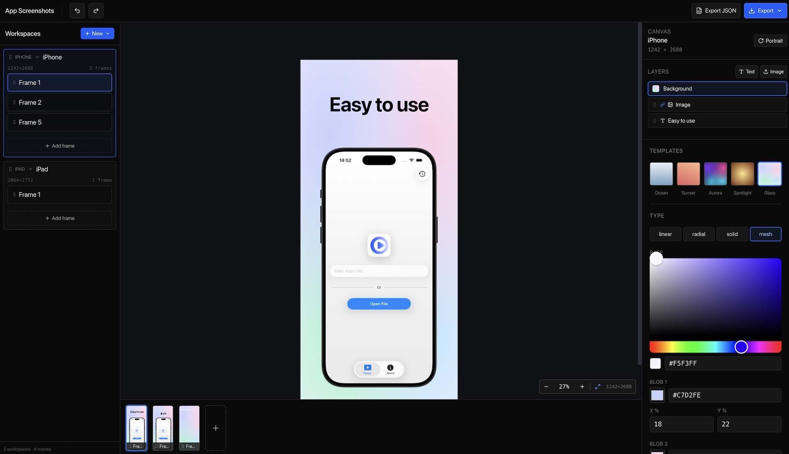

# App Screenshots Generator

A browser-based editor for designing App Store–style marketing screenshots. Compose text and images over gradient / mesh backgrounds, preview at native device resolutions, and export pixel-perfect PNGs — all client-side, no backend.



## Features

- **Layer-based editor** — text and image layers with drag, resize, rotate, corner radius, alignment, and z-order
- **Multi-platform presets** — iPhone (1242×2688), iPad (2064×2752), macOS (2560×1600), tvOS / visionOS (3840×2160), plus a custom workspace size
- **Portrait ↔ landscape toggle** per workspace
- **Rich backgrounds** — linear, radial, solid, and multi-blob mesh gradients with a preset gallery (Ocean, Sunset, Aurora, Spotlight, Glass…)
- **Workspaces & frames** — group multiple screenshots together and switch between them in the sidebar
- **Snap guides** — center-line snapping while dragging, hold <kbd>Shift</kbd> to disable
- **Zoom-to-cursor** — trackpad pinch or <kbd>Cmd/Ctrl</kbd> + wheel
- **Undo / redo** — powered by [`zundo`](https://github.com/charkour/zundo)
- **JSON import / export** — save and share your work
- **PNG export** — rendered at the true device resolution, not the viewport

## Tech Stack

- [React 19](https://react.dev/) + [TypeScript](https://www.typescriptlang.org/)
- [Vite 8](https://vitejs.dev/)
- [Tailwind CSS v4](https://tailwindcss.com/)
- [Zustand](https://github.com/pmndrs/zustand) + [Zundo](https://github.com/charkour/zundo) for state and history
- [html-to-image](https://github.com/bubkoo/html-to-image) for PNG export

## Getting Started

The project uses [Bun](https://bun.sh/) as its package manager.

```bash
# install dependencies
bun install

# start the dev server
bun run dev

# type-check and build for production
bun run build

# preview the production build
bun run preview

# lint
bun run lint
```

Open http://localhost:5173 and start designing.

## Keyboard Shortcuts

| Action       | Shortcut                     |
| ------------ | ---------------------------- |
| Undo         | <kbd>Cmd/Ctrl</kbd> + <kbd>Z</kbd> |
| Redo         | <kbd>Cmd/Ctrl</kbd> + <kbd>Shift</kbd> + <kbd>Z</kbd> |
| Delete layer | <kbd>Delete</kbd> / <kbd>Backspace</kbd> |
| Disable snap | Hold <kbd>Shift</kbd> while dragging |
| Zoom         | <kbd>Cmd/Ctrl</kbd> + scroll, or trackpad pinch |

## License

[MIT](LICENSE)
